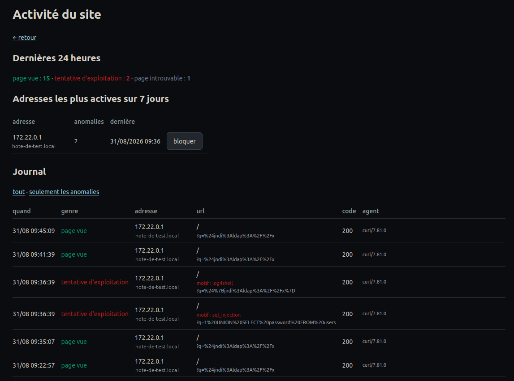

# Sentinelle

**Blocks attackers, never your mail provider.**

It logs every request, recognises exploitation attempts, closes the door on its
own and alerts you. And it refuses to ban an address your site depends on.



*Documentation française : [README.fr.md](README.fr.md)*

```bash
composer require acencyril/sentinelle-bundle
```

---

## The problem

A production site is probed constantly. Scanners look for `/.env`,
`/wp-login.php`, `/.git/config`. Others attempt SQL injection, directory
traversal, Log4Shell. Most of it goes nowhere — but you only know that
afterwards, and only if you look.

The usual answers each have a flaw. Reading web server logs: nobody does it every
day. `fail2ban`: it works on log files, outside the application, and knows
nothing about your routes or your users. A hosted WAF: it sees all your traffic,
and it costs money.

Sentinelle does the work **inside the application**, where you know who is
authenticated, which route answered, and what status code went out.

---

## What it does

**It records everything**, not just attacks. An attempt cannot be recognised on
its own: it is recognised by contrast with ordinary traffic. Without the page
views you are left with a list of alarms and no scale, unable to tell whether
three 404s are a scan or a dead link.

**It classifies every request** — page view, not found, access denied, probe,
exploitation attempt — from the path, the query string and the response code.

**It blocks on its own**, progressively: 24 hours on the first repeat, 7 days on
the second, permanent on the third. Blocks expire, and that is deliberate.

**It emails you**, at most once per address per hour.

**And it refuses to block what you depend on.** This is the piece missing
everywhere else, and the one that justifies this bundle.

---

## Why that last point matters

This bundle was born from an incident. An address appeared on the dashboard,
flagged as suspicious after a 401. It was blocked by hand, with one click. It was
a Mailgun server: **the site's entire inbound mail would have died silently**,
and nobody would have known for hours.

The 401 came from a signing key that had not yet reached the container's
environment. A configuration incident, not an attack.

Hence three safeguards Sentinelle enforces:

**Every address carries its owner's name**, resolved by reverse DNS. You no
longer decide while staring at a string of digits.

**Critical providers are refused for blocking**, automatically *and* manually.
The button does not work, and it tells you why.

**Some paths never trigger a block.** A webhook returning 401 while a key is
being deployed must not get the caller banned.

> Protection that breaks a working part of the site destroys more than it
> defends.

---

## Installation

### 1. Register the bundle

```php
// config/bundles.php
return [
    // …
    Acencyril\SentinelleBundle\SentinelleBundle::class => ['all' => true],
];
```

### 2. Configure

```yaml
# config/packages/sentinelle.yaml
sentinelle:
  # Dry-run: detects, logs and alerts, but blocks nothing. Leave it on for the
  # first few weeks — see § 6 below.
  dry_run: true

  alert:
    recipient:   '%env(SENTINELLE_ALERT_EMAIL)%'
    sender:      'no-reply@example.com'
    site_name:   'My Site'

  access:
    role:            ROLE_ADMIN
    parent_template: 'base.html.twig'
    back_route:      'dashboard'     # or null

  never_block:
    # ⚠ FILL THIS IN BEFORE GOING LIVE.
    # At minimum your own outbound address: without it, one wrong move
    # locks you out of your own site.
    ips: '%env(default::SENTINELLE_ALLOWLIST)%'

    # Your webhooks. A 401 there is a configuration incident, not an attack.
    paths: ['/api/webhook/', '/stripe/callback']

    # Your providers, in addition to the bundle's own list.
    providers: ['.my-signature-provider.com', '.my-cdn.net']
```

Inline comments in the source remain in French. They explain *why* each safeguard
exists, and several come from real incidents — that reasoning is the most
valuable part of this code.

### 3. Routes

```yaml
# config/routes/sentinelle.yaml
sentinelle:
    resource: '@SentinelleBundle/config/routes.php'
    type: php
```

### 4. Schema

```bash
php bin/console doctrine:migrations:diff
php bin/console doctrine:migrations:migrate
```

Two tables: `sentinelle_visit` and `sentinelle_blocked_ip`.

### 5. The purge

Without it the table grows forever **and repeat counters never reset**: an
address blocked six months ago comes back straight at strike two on its first
scan, earning seven days where it deserved twenty-four hours.

```
0 4 * * *  php /path/bin/console sentinelle:purge
```

### 6. Start in dry-run

Sentinelle ships with `dry_run: true` — it detects, logs and alerts, but **blocks
nothing**. Nobody wires automatic blocking into a production site without knowing
what it will shut out. Watch the dashboard for a few days, ask yourself "would I
have wanted to block that one?", then set `dry_run: false`.

Every avoided block is logged with what would have been decided, duration
included.

> A mechanism you cannot try without risk will not be tried — it will be
> installed and switched off at the first incident.

### 7. Check it can do its job

```bash
php bin/console sentinelle:check
```

Checks that the cache answers, both tables exist, the allowlist is not empty and
alerts have a valid recipient. Each of these is a way the mechanism can fail
**silently** — without a cache, counters always return zero, no threshold ever
fires, and detection is disarmed without anything saying so.

---

## The dashboard

`/admin/activity` — prefix and role are configurable.

The request log, filterable down to anomalies only. Blocked addresses with their
reason, strike count and how many requests they have made since. The most active
addresses over seven days. And under each one, **its owner's name** when reverse
DNS provides it.

Manual blocks are permanent by default: an address you block by hand is a
deliberate decision, not a detection.

---

## What it detects

**Critical — blocks and alerts immediately.** Code execution (`php://input`,
`system(`), SQL injection (`UNION SELECT`, `OR 1=1`), directory traversal,
Log4Shell (`${jndi:`), PHP deserialisation.

**Probes — alert in bursts.** Sensitive files (`.env`, `.sql`, `.pem`), config
directories (`/.git`, `/.aws`, `/.ssh`), WordPress and phpMyAdmin paths, script
injection. One probe is noise; fifteen in ten minutes is a scan.

**Brute force.** Ten access denials in ten minutes.

You may **add** your own patterns. You may not remove the bundle's: *whatever you
make configurable, you make accidentally disableable*, and nobody wants to find
out later that their installation had Log4Shell detection switched off.

---

## Three decisions worth explaining

### Logging costs the visitor nothing

It happens on `kernel.terminate`, after the response has been sent. That is also
the only moment when the status code is known.

### Blocking happens before the router

The listener runs at priority **300**, ahead of the router (32) and the firewall
(8). A banned address consumes no route resolution, no session, no database
query. It gets a bare 403 with no error page: answering a scanner in detail only
teaches it what it triggered.

### The anti-flood quota stops writing, not counting

A 155-request scan in 16 seconds must not produce 155 rows. But the quota blocks
**only** the insert: the counters keep running. Otherwise the burst threshold of
15 would never be reached after 5 probes, and the alerting mechanism would
neutralise itself at the exact moment it becomes useful.

---

## Behind a reverse proxy

⚠ Without `trusted_proxies` configured, **every request appears to come from the
same address** — your proxy's. Automatic blocking then cannot tell two visitors
apart, and a single scanner would get the gateway banned, therefore everyone.

Private ranges are allowlisted by default, precisely to prevent this from
happening during development. In production, configure
`framework.trusted_proxies`.

---

## What it does not do

**It does not inspect request bodies** — expensive, and often personal data you
should not be storing. Only the path and query string are examined.

**It does not replace your web server.** The crudest probes are better stopped
upstream, before they reach PHP.

**It does not protect you from an application flaw.** It tells you someone is
looking for one.

**It redacts secrets before writing.** A `?token=…` parameter is stored as
`token=***`: without this, every legitimate call would write a secret in
cleartext into a table readable from the admin interface.

---

## When things degrade

Every failure mode leans the same way: **let traffic through rather than refuse
everyone**.

Cache down, database unreachable, write failure, mail not sent — the request
continues and the error goes to the logs. A missed block is less serious than a
site that turns everybody away.

---

## Upgrading from 0.2

Version 0.3 renamed everything to English — configuration keys, tables, routes
and the admin path. See [CHANGELOG.md](CHANGELOG.md) for the full mapping.

---

## Licence

MIT.

## Contributing

See [CONTRIBUTING.md](CONTRIBUTING.md). Detection patterns and the list of known
providers improve through use — if your provider is missing from the defaults,
that is a one-line pull request.